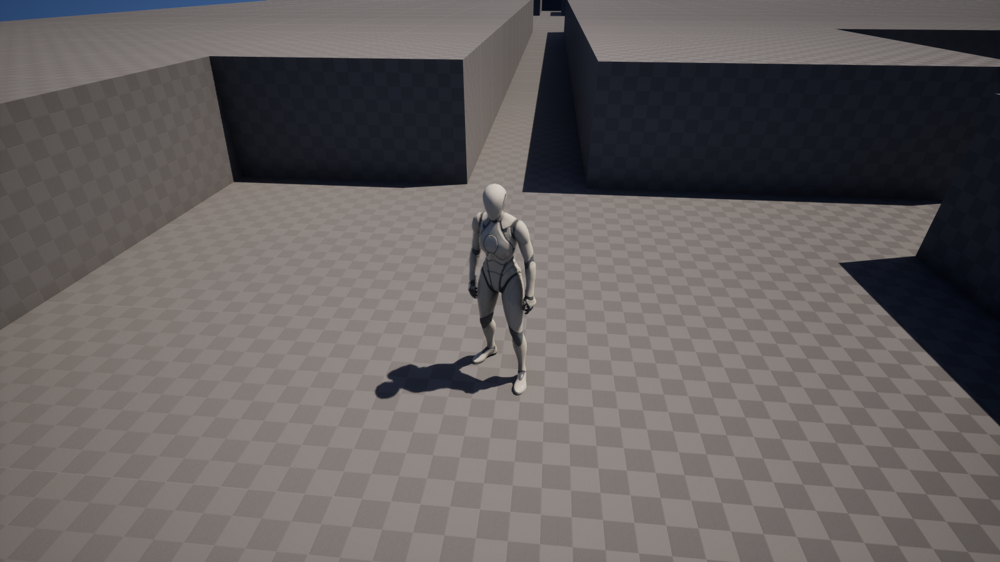
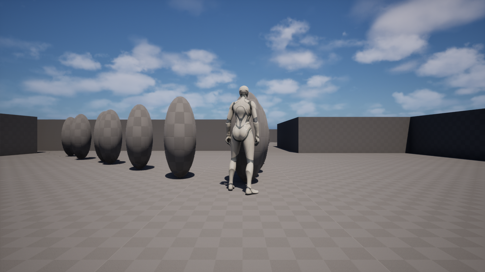

# uegame — UE 5.8 种子化 roguelite 切片,agent-first + 证据门禁

> 文档语言:本文件(中文)为准;[README.en.md](README.en.md) 是英文翻译快照。M2 的引擎集成深潜文档在 [m2_ue/M2_UE_README.md](m2_ue/M2_UE_README.md)(中文)。

**uegame** 是跑在 Unreal Engine 5.8 上的种子化 roguelite 垂直切片:程序化地牢、数据驱动的近战、三层一局(层数由 DataTable 决定)、逐层缩放、胜负循环。同一个种子就是同一局——布局、敌人布点、层间种子链是被 **逐位校验** 的确定性属性,不是"应该没变"的假设。

它同时是一次关于"怎么造出来"的实验:M1→M4 全程由 AI coding agent 在证据门禁下实现——预测先于引擎运行被 **预注册**,跨编译器哈希互证,引擎内取证探针,独立审计,跨工具对抗评审。这份 README 同时交代游戏与过程:文中每个数字都能追溯到本仓库的某个提交、PR 线程或文件;凡属人手完成、机器不可达或未经验证之处,原文写明。

状态:v1 冻结基线完整闭环(M1+M2+M3+M4),PR #3 于 2026-07-02 合并(合并提交 `94e679d`)。此后 `main` 又经 Run 2(PR #7)、Run 2.5(PR #10)、M5 #12B(PR #13,合并提交 `c943c014`)推进,先后加入敌人感知模型、战斗反馈、"清空才可下楼",以及把 Build 多样性 loadout(非末层清空后三选一、resolved 数值)接进 gameplay。

本文分两部分:下面的《当前游戏状态(Run 2.x)》反映线上实际玩到的版本;其后的 **§1–§8 是 v1/M4 冻结事实**,原样保留为历史证据,每个数字仍追溯到它最初的提交/PR/日志锚点。

---

## 当前游戏状态(Run 2.x)

`main` 已含 M5 #12B(合并提交 `c943c014`)。Run 2([PR #7](https://github.com/My-Denia/uegame/pull/7),`playability`)带来随机但可复现的首局种子、出货用的关卡内置 spawner、provisional 平衡;Run 2.5([PR #10](https://github.com/My-Denia/uegame/pull/10),`combat-feel`,提交 `b932e21` + `7efdff0`)加入感知模型、战斗反馈、清空才可下楼;M5 #12B([PR #13](https://github.com/My-Denia/uegame/pull/13),`feat/m5-loadout-ue-binding`,合并提交 `c943c014`)把引擎无关的 Build 多样性 loadout 接进 gameplay——非末层清空后弹出三选一词缀,选择即改变 resolved 伤害/攻速/血量,reward-pending 在楼梯门前拦截下楼直到选择;末层不弹、直接走通关(取证动词随之到 18 个,见下);M6(Encounter Diversity)把引擎无关的 m6 核心(房间 role + 敌人 archetype,composition-only)接进 gameplay——每层房间在冻结布局上获得 Quiet/Standard/Skirmish/Stronghold 语义 role,敌人按 role 加权成为 Grunt/Runner/Brute 三 stat 变体(Grunt 与 Default 行逐字段 parity;视觉只缩放 BodyMesh,胶囊/ContactRange 不动;数量、位置、spawnPlanHash/enemyPlanHash 全部保持 M5 基线,新增 roomRoleHash/enemyTypeHash 两锚;取证动词随之到 20 个,见下)。引擎无关生成核心(dungeon.hpp / m2_adapter.hpp)自 v1 起逐字节冻结——seed-7 的布局哈希锚点(ts100 `planHash`、ts200 `planHash`、tile 无关 `enemyPlan`)不动;敌人数量与逐层缩放改由下方当前 CSV 驱动。

**当前数值(单一来源 [CombatConfig.csv](uegame/Content/Data/CombatConfig.csv);改表需重启编辑器,加载器是进程级一次性缓存):**

| 字段 | 当前值 |
|---|---|
| EnemyMaxHP | 30 |
| EnemyMoveSpeed | 240 |
| EnemyContactDamage | 7 |
| EnemyDamageInterval | 1.5s |
| AggroRange / LeashRange | 900 / 1400 |
| PlayerMaxHP | 140 |
| PlayerAttackDamage / Range / Cooldown | 15 / 250 / 0.6s |
| EnemiesPerRoom | 2 |
| PerFloorScaling | 0.5 |
| bRequireFloorClearToDescend | true |
| MaxFloors | 3 |

相对 v1/M4 存档平衡的变化(存档值见 §1 记分板 / §3,锚 `ad57d7e` / `1ec27c4`):接触伤害 10 点/1.00s → 7 点/1.5s;玩家 HP 100 → 140;逐层缩放 1.0 → 0.5(floor 3 由每房 6 敌、effHP 90 降到每房 4 敌、effHP 60,三层敌数 16/24/36 而非存档的 16/32/54);下楼门 descend-anytime(false)→ 清空才可下楼(true)。AggroRange/LeashRange 为 Run 2.5 新增。当前逐层集合用 `m2test floors 7 --csv uegame/Content/Data/CombatConfig.csv` 复现(布局 planHash 与存档逐位相同,敌人 enemyHash 随缩放移动)。

**敌人感知模型(Run 2.5)。** 敌人仅在 AggroRange(900)内 **且有视线** 时锁定玩家;视线是 capsule 中心高度的水平 `ECC_WorldStatic` 射线,只有高墙遮挡(薄地板/走廊/门板被同高度射线掠过)。追击后要越过 LeashRange(1400)才脱战(LeashRange > AggroRange = 迟滞;追击中不再复检视线,拐角不闪断)。未锁定的敌人原地待命——不游荡、不隔墙锁定、不造成接触伤害(uegame/Source/uegame/Combat/DungeonEnemy.cpp 的 `PursueTick` / `ComputeLOSTo`;grep 锚 `[Aggro]`)。

**清空才可下楼(Run 2.5)。** `bRequireFloorClearToDescend=true`:楼梯在本层每个有敌房间清空前拒绝下楼(v1 默认是随时可下楼)。边沿触发补丁:玩家站在楼梯垫上时清掉最后一间房,会就地重新触发下楼(`7efdff0`)。

**三个战斗反馈(Run 2.5),都可 grep 日志锚:** (1) 敌人受击白闪(~0.12s,经 `OnDamaged`,`[Feedback] hitFlash`);(2) 每次挥击画扇形攻击弧、命中与否都画(`ENABLE_DRAW_DEBUG` 门内,`[Feedback] attackArc`);(3) 玩家受接触伤害时屏幕红脉冲(相机淡入淡出 0.5→0、0.25s,`[Feedback] playerPulse`)。

**取证动词现为 20 个。** Run 2.5 新增第 16 个 `Dungeon.AggroStatus`;PR #12B(M5 loadout)新增第 17、18 个 `Dungeon.LoadoutStatus` 与 `Dungeon.ChooseLoadout`;M6B(encounter UE binding)新增第 19、20 个 `Dungeon.RoomRoles`(runSeed/floor/floorSeed/roomRoleHash/每房 role)与 `Dungeon.EnemyRoster`(archetype 计数、每房 roster、resolved stats、enemyTypeHash + 保持不变的 m2 锚)(全部 shipping-gated,在 `!UE_BUILD_SHIPPING` 门内)。下方 §7 的动词表列的仍是 v1/M4 的 15 个集合(冻结历史)。

**CI(Run 3)。** 4 个引擎无关 g++ 确定性门(`m1verify 1000`、`m2test validate 200`、`enemyDeterminism 500`、`floorsDeterminism 200`,定义在 [CMakeLists.txt](CMakeLists.txt))现由 [.github/workflows/core-ctest.yml](.github/workflows/core-ctest.yml) 在每个 pull request 与推送到 main 时运行——此前这些门只能本地手动跑。

---

## v1 / M4 冻结事实(以下原样保留为历史证据)

> 从这里往下是 v1/M4 的证据记录,逐字保留、未作改动:文中数字追溯到各自最初的锚点(提交/PR/日志)。当前游戏数值见上方《当前游戏状态(Run 2.x)》;旧平衡数字(接触 10 点/1.00s、玩家 HP 100→0、每房 6 敌等)是 v1/M4 期的存档证据,不是当前值。

## 1. 五分钟版本

三个目标:

1. 在真实引擎栈上交付一个可玩的 roguelite 切片,而不是 demo 幻灯片;
2. 生成→布点→层进程全链确定性,任何人可用两条命令独立复验;
3. 验证一套 agent 驱动的开发框架——并诚实记录它的边界。

| | |
|---|---|
|  |  |
| M2:seed 7 的地牢里沿走廊实走 | M4:runSeed 7 第三层,六个缩放后敌人围压,通关楼梯前约 3 秒(`6a9858f`) |

记分板——每行断言都可沿锚点复核:

| 断言 | 锚点 |
|---|---|
| 布局哈希在 4 次独立 PIE 会话一致,且与 g++ 独立构建逐位相同(tileSize=100;tileSize=200 两轮一致) | `816a8dc`;[M2_UE_README L12](m2_ue/M2_UE_README.md) |
| 实体化保真:441 个可走格 == 441 个计划可通行格;世界内可达 441/441;8/8 房间全连通 | `816a8dc` |
| M4 三层共 6 个哈希(布局+敌人)先在 g++ 侧预注册,后在引擎内逐位复现——含评审修复轮之后、零控制台输入的自启路径 | `8a4929c` → `5824e68` / `c7deca2` |
| 200 个 runSeed 各生成两遍,楼层序列 200/200 逐位相同;相邻 runSeed 200/200 互不相同 | `8a4929c` |
| 敌人布点确定性:500 种子四项断言各 500/500(逐位相同、全在房内、起始房除外、零重复格);饱和压力下 509/509 精确布点 | `048ad06` / `686938b` / `1463b30` |
| 独立验证器(用户提供,非 agent 自建)在两个种子区间 1000/1000 通过验证+确定性 | `524be80` |
| 接触伤害节奏 10 点/1.00s、玩家 HP 100→0、死亡重启 ×2,全部日志取证 | `ad57d7e` |
| 每条 Codex 评审 P2 都有对应修复提交与回归证据,线程全部 resolve | PR #1 / PR #3 评审线程 |

想直接上手:跳到 [§7 如何运行](#7-如何运行)。想看方法:[§4 验证方法论](#4-验证方法论)。想看这套流程做不到什么:[§5 诚实边界](#5-诚实边界)。

---

## 2. 架构:四层,以及为什么这么切

```
dungeon.hpp            M1 引擎无关核心:布局生成 + 校验(纯 C++17,无引擎类型;契约冻结)
   │                     tag: m1-baseline → f357ff8
m2_adapter.hpp         M2/M3/M4 引擎无关适配:格→世界坐标、连通复核、FNV-1a 布局哈希、
   │                     敌人布点计划、splitmix64 层种子链与缩放辅助
uegame/Source/uegame   UE 胶水:DungeonSpawner(ISM 几何/碰撞/运行时 navmesh)、
   │                     FloorManager(GameInstance 子系统:局/层状态机)、Combat/、DungeonStairs
uegameEditor           MCP 工具集(ExecConsoleCommand/StartPIE/StopPIE/GetPIEStatus)
                         + 15 个 Dungeon.* 取证动词(全部 shipping-gated,在 !UE_BUILD_SHIPPING 门内)
```

为什么这么切:

- **核心先于引擎存在**。适配层建成并通过 g++ 验证时,这台机器上还没有装 UE——提交正文原话 "no UE on this machine, not compiled"(`822dfa4`;同一事实在 `2455032` 再次记录)。算法的正确性从不依赖引擎在场。
- **一份源码,两个编译器互证**。`dungeon.hpp`/`m2_adapter.hpp` 留在仓库根,同时被 WSL g++ 独立构建和 UE 的 MSVC 构建编译(include 路径接线于 `2455032`;MSVC 侧编译实证于 `8eabc1b`)。同种子在两边必须打出逐位相同的哈希——确定性是被检查的性质,不是被祈祷的性质。
- **反射隔离**。两个头只在 .cpp 里 include,绝不进任何 UHT 反射头([M2_UE_README L40–42](m2_ue/M2_UE_README.md)),UE 的 unity build 与 IWYU 不会波及核心。
- **数值单一来源**。战斗与层进程数值全部来自 [uegame/Content/Data/CombatConfig.csv](uegame/Content/Data/CombatConfig.csv),运行时加载、加载时回显一行、缺表大声报错(`593a88b`),打包构建以 NonUFS 松散文件携带(`4358a35`)。
- **随机性纪律**。所有随机抽取来自单个显式种子的 `std::mt19937_64`;无时间种子、无全局 rand、无静态可变状态(dungeon.hpp 首注);敌人布点用 `seed ^ 0x9E3779B97F4A7C15` 子流,布局流不受扰动(`048ad06`);层种子链是 splitmix64 纯整数管线,不消耗任何 RNG 流(`8a4929c`)。

---

## 3. 里程碑

### M1 — 引擎无关地牢生成器

拒绝采样布房 → 房心完全图 → Prim 最小生成树保底连通 → 少量环边 → L 形走廊与门(dungeon.hpp 首注;默认 64×40 格、8–12 房,dungeon.hpp:51–54)。

| 断言 | 锚点 |
|---|---|
| 1000 种子可达性 + 确定性 + 对抗式验证器审计 | `f357ff8` |
| 独立复验:两个区间(seeds 1..1000、5000..5999)1000/1000 验证+确定性,房数范围 [8,12] | `524be80` |
| 验证器只用 `dungeon::` 公共 API,与 agent 自己的 harness 分离 | [m1_verify.cpp](m1_verify.cpp) 首注 |
| 契约冻结后,后续里程碑回归恒绿(例:validate 100 → 100/100) | `686938b` |

### M2 — 落进 UE:保真、可走、确定

抽象 `Layout` 实体化为可行走的第三人称关卡,四条验收全部经 MCP 驱动 PIE 取证(`816a8dc`)。

| 断言 | 锚点 |
|---|---|
| 保真:2560 个实例;441 可走格 == 441 计划格;世界可达 441/441;8/8 房;fully-connected=YES | `816a8dc` |
| 可走:NAVPATH valid=YES partial=NO points=11 length=14976(直线距离 9485,碰撞约束下绕行);实走到最远房 ARRIVED dist2D=39,30.7s | `816a8dc`;[M2_UE_README L11](m2_ue/M2_UE_README.md) |
| 确定:同种子布局哈希 4 次 PIE 会话一致、与 g++ 逐位相同 | `816a8dc` |
| 适配层独立检查:500 种子世界连通与网格一致 500/500 | `822dfa4` |
| 累计 >120k 次 generate+validate 零失败(文档级记录) | [M2_UE_README L31](m2_ue/M2_UE_README.md) |

取证途中修掉的三个运行时导航问题(两次 Live Coding 热修,`816a8dc`):运行时 NavMeshBoundsVolume 空 bounds、界外 dirty area 被丢弃、以及本文 [§5 的案例研究](#5-诚实边界)——走廊侵蚀。

### M3 — 数据驱动的最小战斗

敌人追击、接触伤害、玩家近战、房间清空事件;敌人布点在引擎无关层生成,起始房刻意除外——玩家出生点无伏击,这是记录在案的设计偏离(`593a88b`)。

| 断言 | 锚点 |
|---|---|
| 敌人布点哈希在 3+ 会话一致 == g++ 值;哈希只含 tile 无关字段,任何 tileSize 下同值 | `ad57d7e` / `048ad06` |
| 布点确定性 500/500 逐位相同、500/500 全部房内、500/500 起始房除外 | `048ad06` |
| 追击收敛:nearestDist 1396→630→70;首寻路 68/98 成功——30/98 输给 navmesh 构建竞态,靠 0.5s 重寻恢复(诚实数字,原样保留) | PR #1 |
| 伤害链路 CSV 可溯:接触 10 点/1.00s 节奏、HP 100→0、重启 ×2;近战 15+15=30 击杀;冷却拒绝 ×3 | `ad57d7e` |
| 房间清空只动目标房,其他房计数不受影响 | `ad57d7e` |
| 评审反例封死:seed 1 room 9 (14,35) 重复布点 → 无放回抽样 + 预算耗尽时确定性精确回落;饱和压力 509/509 | `686938b` / `7c5a769` / `1463b30` |

### M4 — 层进程、缩放、胜负循环(v1 闭环)

FloorManager(GameInstance 子系统)持有 {runSeed, floorIndex};层切换走单一的原地重生成路径——不换关卡,世界与 navmesh 存活,玩家 HP 顺带跨层保留(`1ec27c4`)。这一手直接埋掉了 M3 的已知缺陷:OpenLevel 会杀死 RecastNavMesh(`5824e68`)。

| 断言 | 锚点 |
|---|---|
| 预注册:runSeed=7 三层的层种子、布局哈希、敌人哈希、缩放数值,连同 nextRunSeed 与反例(runSeed=8 首层哈希不同),全部在任何 PIE 运行之前录入提交 | `8a4929c` |
| 原地重生成后导航存活:floor2 布局哈希复现预注册值;敌人重新寻路 RequestSuccessful,nearestDist 2000+→81 | `5824e68` |
| 评审修复轮之后全链复现:零控制台输入自启即重现 run-7 链;六哈希全中;`[RunWon]` 后随的 `[RunRestart]` 携带与 g++ 一致的新 runSeed(FloorManager.cpp:274/293) | `c7deca2` |
| 缩放数据驱动:floor 3 时 6 敌/房、effHP=90,公式与 DataTable 回显逐层打进 [FloorConfig] | `1ec27c4`;PR #3 |
| HP 跨层保留:[FloorStarted] floor=2 playerHP=23/100 | PR #3 |
| 种子链跨 3 个独立会话复现,并由独立 auditor 对照 g++ 复核 | PR #3 |
| 独立审计:6/6 验收达成;同一审计用 MD5+日志时间戳抓出两张截图标注错误,证据重标后才收口 | PR #3;`6a9858f` |
| 同帧竞态封死:死亡升级覆盖排队中的下楼,任何楼层不会以死人开局 | `c7deca2` |

---

## 4. 验证方法论

这套流程里可迁移的部分,恰好是六条纪律:

**先预测,再开引擎。** 一切影响生成的改动都带预注册预测:引擎无关核心用 g++ 独立构建,打印参考值——层种子、布局哈希、敌人哈希——在编辑器运行之前写进提交正文(`8a4929c`)。UE 侧必须用另一个编译器、另一个进程逐位复现:先是 spike(`5824e68`),然后是评审修复轮后的全链零输入复现(`c7deca2`)。预测失败,里程碑停摆。哈希值本身刻意不在本文重印——仓库的规矩是复现命令才是真源(`m2test floors 7 --csv uegame/Content/Data/CombatConfig.csv`,见 §7),值录在不可变的提交正文里,本文只指路、不复制。

**钉住的哈希当回归甲。** seed-7 的布局哈希与敌人哈希在每次高风险改动后重新断言:删模板变体后(`9ffaa26`)、TileSize 默认值切换后(`8faf20a`)、评审修复后(`1463b30`)、M4 基座上(PR #3)。哈希不变,重构才算无害。

**日志锚断言,不靠肉眼。** PIE 取证以 grep 日志锚为准([RunStarted]、[FloorConfig]、[FloorCompleted]、[RunWon]、[RunFailed] 等,见 `1ec27c4`/`c7deca2` 正文),截图只作插图。理由见 §5 的案例研究:好看的截图恰恰漏掉了真缺陷。

**审计要有牙齿。** M4 收口前,独立执行审计对照原始证据复核 6/6 验收——并且真抓出了问题:两张截图的拍摄时刻标错(按截图编号推断,而非按 MD5+日志时间戳核对),证据重标后才放行(`6a9858f`;PR #3)。审计不是仪式。

**跨工具对抗评审。** 每个 PR 由另一个模型(Codex)逐轮评审:它给出过真反例(seed 1 room 9 的重复布点,`686938b`),迫使抽样改为无放回并加上精确性断言;它也把评审面问题暴露到位——Epic 模板变体在三轮评审中积累 13 条 P2/P3,最终 owner 拍板整体删除(`9ffaa26`)。每条 P2 的关闭都带修复提交与回归证据(修复提交自记条数:`686938b` 5×P2+1×P3、`4358a35` 2×P2、`1463b30` 2×P2、`c7deca2` 3×P2)。

**验证器与被验者分离。** M1 的复验程序只使用 `dungeon::` 公共 API,文件首注原话:"Not the agent's harness"——而且它是用户提供的既有文件,按要求入库(`524be80`)。对 agent 工作的检查,本身不出自 agent 之手。

---

## 5. 诚实边界

**agent 没做的事。** 人类安装了 UE 5.8 并登录 Epic 启动器,从 Epic 第三人称模板创建了工程(`dcef21b`),启用了 MCP 编辑器插件(`a5795fa`,提交原话 user-enabled),并持有口味与范围的决定权:节奏手感、"随时可下楼"的默认门策(`1ec27c4`),以及在评审反复命中从未使用的模板代码后、把它们整体删除的决定(`9ffaa26`,提交原话 owner decision)。连 M1 的独立验证器都是以"用户既有文件、按要求提交"的身份入库的(`524be80`):对 agent 工作的核查本身就是人类供给的。每次合并进 main 也由人放行。

**机器够不着的地方。** MCP 桥每个引擎 tick 只泵一条控制台命令,所以"同帧两动作"的竞态(下楼已排队、同帧死亡)从外部注入不可达——最终把探针编译进游戏本体来验证(`Dungeon.DescendThenDie`,`c7deca2`)。HighResShot 渲染不带 HUD,屏幕上的 RUN WON 字样无法截图取证,胜利以 [RunWon] 日志为证(`6a9858f`)。证据管线本身也被审计而非被信任:M4 截图第一版标注就错了两张,靠 MD5+时间戳交叉核对抓出(`6a9858f`)。

**案例研究:看起来能走的走廊。** tileSize=100 时,一格宽走廊物理上能通过(玩家胶囊直径 84cm < 100cm 走廊;半径 42,uegame/Source/uegame/uegameCharacter.cpp:24),截图里也完全正常——但 navmesh 的 AgentRadius=35 从两侧侵蚀后剩余宽度低于可行阈值,Recast 直接把走廊剔除,每个房间成了导航孤岛。人眼看截图发现不了;暴露它的是客观断言:NAVPATH partial 标志与 MoveToActor 的返回值(`816a8dc`)。修复收在适配层:spawner 默认 TileSize 200(`8faf20a`),M1 核心一行未动。此后每个里程碑的验收都以日志断言为准,截图降级为插图。这是全文最重要的一课:好看不等于正确,能走不等于能寻路。

**已知局限(原样陈列)。** 近战与接触判定是距离+朝向检查,无视线遮挡,理论上可隔墙判中(uegame/Source/uegame/Combat/,前向球形范围检查);敌人首个寻路请求可能输给 navmesh 构建竞态(30/98,PR #1),靠 0.5s 重寻恢复,首次成功时刻未单独记录;M3 的死亡重启走 OpenLevel,新世界导航在同一 PIE 会话内会退化——M4 的局内循环已改为原地重生成绕开此路径(`5824e68`),单层模式保留旧行为;胜利画面是调试文本,不是 UI 菜单(`6a9858f`)。

---

## 6. 问题清单(被杀掉的坑)

| 问题 | 根因 | 修复 |
|---|---|---|
| MCP 工具集静默注册失败 | StartupModule 时编辑器子系统尚不存在,注册无声失败 | 延迟到 OnPostEngineInit 注册 `18c8afa` |
| 运行时 NavMeshBoundsVolume 边界为空 | 运行时 brush 无几何,SpawnActor 内部即以空 bounds 注册 | 延迟 spawn + FinishSpawning 前挂地图尺寸 BoxComponent `816a8dc` |
| 地牢几何的 dirty area 被丢弃 | 几何注册早于 nav 体积,界外 dirty 被弃 | 体积注册后全图 AddDirtyArea 重铺 `816a8dc` |
| 走廊可走但 AI 无法寻路 | tile100 走廊被 AgentRadius=35 侵蚀后剔除 | 默认 TileSize 200,适配层吸收,核心不动 `8faf20a` |
| 敌人布点出现重复格 | 有放回抽样;评审反例 seed 1 room 9 | 无放回 + 预算耗尽确定性精确回落 `686938b` / `7c5a769` / `1463b30` |
| Dungeon.Spawn 污染编辑器关卡 | PIE 不活时 MCP 桥回落到编辑器世界 | 拒绝非游戏世界 `1463b30` |
| 打包后战斗数值静默回落默认 | 裸 CSV 不进 cook | DefaultGame.ini NonUFS 松散文件 staging `4358a35` |
| CodeQL 必查项 exit-32 fatal | 分支缺 .github/workflows,actions 语言零输入 | merge main 带上 workflow 文件 `c76a782` |
| 无局时楼梯凭空出现 | BeginPlay 与取证 Regen 也会 spawn 楼梯 | run-active 单点门禁 `c7deca2` |
| 死亡与排队下楼同帧竞态 | pending 只是 bool,无优先级语义 | 枚举化 + 死亡升级覆盖;in-handler 复合探针验证 `c7deca2` |
| 层切换杀死导航 | OpenLevel 重建世界,RecastNavMesh 丢失 | 原地重生成:despawn→Build→re-dirty→teleport→respawn `5824e68` |
| 截图证据标注错误 | 按截图编号推断拍摄时刻 | 独立审计 MD5+日志时间戳交叉核对,重标 `6a9858f` |
| 评审面被模板代码撑爆 | 从未使用的 Epic 变体仍在编译,13 条 P2/P3 无界累积 | owner 决策整体删除(源码+资产 ~3.9MB) `9ffaa26` |
| 弃用警告只在全量构建现身 | Live Coding 增量掩盖 C4996 | 全量 clean rebuild 纳入门禁,顺手修复 `8faf20a` |

---

## 7. 如何运行

前置:Windows 10/11;UE 5.8(Epic Games Launcher 安装);Visual Studio 2022 C++ 桌面工作负载(实测工具链 MSVC 14.44 + Win SDK 10.0.26100,`8eabc1b`);Git。仓库在 UE 工程入库时约 847 个文件、~135MB(`dcef21b`)。

```
git clone https://github.com/My-Denia/uegame.git
"<UE_5.8 安装根>\Engine\Build\BatchFiles\Build.bat" ^
  uegameEditor Win64 Development -project="<repo>\uegame\uegame.uproject" -WaitMutex
```

预期尾行 `Result: Succeeded`(增量构建实测 16.75s,`8eabc1b`)。`<UE_5.8 安装根>` 即 Epic Launcher 安装 UE_5.8 的目录(Launcher 默认 `C:\Program Files\Epic Games\UE_5.8`;本仓库取证机装在 `(x86)` 变体路径下,以你机器的实际路径为准)。注意:编辑器开着时 Live Coding 会挡 UBT,先关编辑器(`8eabc1b`)。

**玩。** 打开 `uegame\uegame.uproject`,PIE 运行默认地图 Lvl_ThirdPerson(uegame/Config/DefaultEngine.ini:2)。无需任何控制台输入:地图内摆放的 DungeonSpawner(出货入口)在 BeginPlay 起一局,首局种子默认熵源随机(`[RunSeed] source=entropy`);可复现走 `Dungeon.SetRunSeed 7` 或配 `bUseFixedFirstSeed=true`(demo 钉种子 7)。无 spawner 的地图仍由 FloorManager 自举兜底。F 键近战(`593a88b`);踩最远房间的楼梯垫下楼;第 3 层再下即胜(MaxFloors=3,[CombatConfig.csv](uegame/Content/Data/CombatConfig.csv));死亡判负,换链上新种子重开第 1 层。改 CSV 数值后需重启编辑器——加载器是进程级一次性缓存(uegame/Source/uegame/Combat/CombatConfig.cpp:15 的 LoadOnce)。

**取证控制台**(15 个动词,uegame/Source/uegame/DungeonEvidence.cpp:43–692——全部在 `!UE_BUILD_SHIPPING` 门内,含 M2 期的 `Dungeon.Spawn`/`Dungeon.WalkFar`,不再编译进 Shipping):

| 动词 | 用途 |
|---|---|
| `Dungeon.StartRun <seed>` / `Dungeon.SetRunSeed <n>` | 起一局并锚定种子链(直接) / 钉首局种子并经入口 resolver 重开(复现入口路径) |
| `Dungeon.Descend` / `Dungeon.FloorStatus` | 排队下楼 / 层·HP·敌数快照 |
| `Dungeon.SetHP <v> [holdSec]` / `Dungeon.DescendThenDie` | 设 HP(0 触发死亡;holdSec 开无敌保持)/ 同帧下楼+致死复合探针 |
| `Dungeon.BalanceReport` | 逐层战斗数值(TTK、K=1/2/4 沥血、缩放)+ 站桩首接触/存活探针 |
| `Dungeon.Regen <seed>` | 原地重生成(M4 spike 验证路径) |
| `Dungeon.Spawn <seed> [tile]` / `Dungeon.WalkFar` | 单层生成(拒绝编辑器世界)/ 寻路取证+实走最远房 |
| `Dungeon.CombatStatus` / `Dungeon.Attack` / `Dungeon.KillNearest` | 战斗快照 / 出刀 / 击杀最近敌 |
| `Dungeon.TeleportToRoom <n>` / `Dungeon.FaceNearest` | 传送到房 n / 面向最近敌(近战前向偏移用) |

日志在 `uegame/Saved/Logs/uegame.log`,grep 锚:`[RunStarted]` `[FloorConfig]` `[FloorStarted]` `[FloorCompleted]` `[RunWon]` `[RunFailed]` `[RunRestart]` `[Stairs]` `[RoomClear]`(注册于 FloorManager.cpp 与 DungeonSpawner/Combat 各处 UE_LOG;引用见 `1ec27c4`/`c7deca2` 正文)。

**引擎之外(独立复验侧)。** 不需要 UE,任何 C++17 编译器:

```
bash build.sh                                         # M1 演示 CLI(→ ./dungeon;脚本入库为非执行位,故用 bash 调起)
g++ -std=c++17 -O2 -Wall -Wextra -Wpedantic m1_verify.cpp -o m1_verify && ./m1_verify 1000
g++ -std=c++17 -O2 m2_adapter_test.cpp -o m2test && ./m2test floors 7 --csv uegame/Content/Data/CombatConfig.csv
```

**确定性自查配方(两条命令级)。** 上面 `m2test floors 7 --csv uegame/Content/Data/CombatConfig.csv` 打印三层的种子与哈希;PIE 里 `Dungeon.StartRun 7` 后逐层下楼,grep 日志里的 planHash / enemyPlan——两侧必须逐位相同。这正是 M4 验收跑过的路径(`8a4929c` → `c7deca2`)。

---

## 8. 仓库地图

```
dungeon.hpp             M1 核心(冻结契约,tag m1-baseline)
m2_adapter.hpp          引擎无关适配层(M2/M3/M4 的哈希、布点、种子链都在这)
m1_verify.cpp           独立验证器(仅公共 API;用户提供)
m2_adapter_test.cpp     适配层 CLI(report/validate/determinism/enemies/floors)
main.cpp + build.sh     M1 演示 CLI
m2_ue/M2_UE_README.md   M2 引擎集成深潜(中文:运行时 navmesh 排障三连、复现命令)
m2_ue/evidence/         6 张取证截图(provenance 经 MD5+时间戳审计,6a9858f)
uegame/                 UE 5.8 工程(Source/uegame 运行时模块、Source/uegameEditor MCP 模块、
                          Content/Data/CombatConfig.csv 数值单源、Config/)
.github/workflows/      PR 评审自动化(Claude review;CodeQL 由仓库默认配置提供)
```

评审轨迹本身也是展品:[PR #1](https://github.com/My-Denia/uegame/pull/1)(M2+M3,多轮 Codex 评审与逐条关闭)、[PR #3](https://github.com/My-Denia/uegame/pull/3)(M4,预注册链复现 + 独立审计 6/6)。

本仓库暂无 LICENSE 文件(保留所有权利);如需复用请开 issue。
